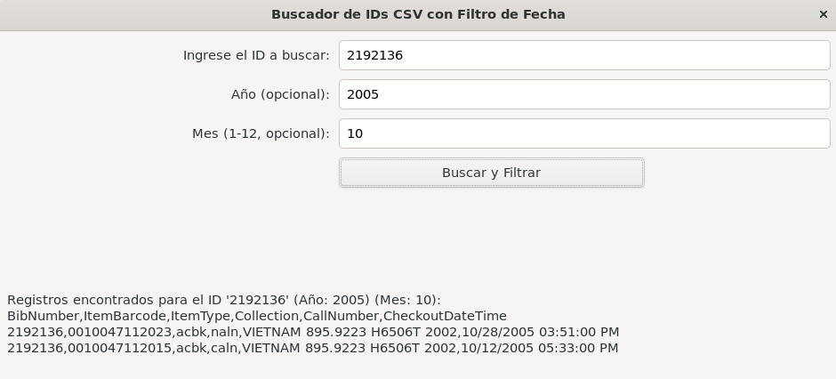

# Sistema de Búsqueda de Préstamos de la Biblioteca Pública de Seattle

Este documento describe el sistema de búsqueda de préstamos de la Biblioteca Pública de Seattle, incluyendo la descripción del dataset utilizado, los campos clave, los criterios de búsqueda implementados, la justificación de estos criterios y ejemplos de uso del programa.

## 1. Descripción de la Base de Datos

Este conjunto de datos contiene un registro de todos los préstamos físicos de ítems realizados en la Biblioteca Pública de Seattle, desde abril de 2005 hasta septiembre de 2017. No incluye renovaciones. Su descarga gratuita está disponible al público en: https://www.kaggle.com/datasets/seattle-public-library/seattle-library-checkout-records?select=Checkouts_By_Title_Data_Lens_2012.csv.

## 2. Campos del Dataset Seleccionado

A continuación, se presenta una descripción detallada de los campos del dataset proporcionado, incluyendo los rangos de entrada válidos para cada uno.

* **BibNumber** 
    * Descripción: Identificador único del registro bibliográfico (título o ítem en el catálogo).
    * Tipo: Numérico.
    * Ejemplo: 2700635.

* **ItemBarcode** 
    * Descripción: Código de barras único asignado a cada ejemplar físico.
    * Tipo: Cadena numérica.
    * Ejemplo: 0010072332389.

* **ItemType** 
    * Descripción: Tipo de ítem prestado (libro para adultos, DVD, audiolibro, etc.).
    * Tipo: cadena de 3 a 5 letras.
    * Ejemplo: acbk.

* **Collection** 
    * Descripción: Sección o colección de la biblioteca a la que pertenece el ítem (CA9-Geneal. Bibliographies, CS 8 - NW Arts, etc.).
    * Tipo: Código de texto, generalmente de 4 a 6 caracteres.
    * Ejemplo: namys.

* **CallNumber** 
    * Descripción: Número de clasificación del ítem, usado para localizarlo físicamente en la biblioteca.
    * Tipo: Cadena alfanumérica.
    * Ejemplo: 133.32424 M7813T 2010.

* **CheckoutDateTime** 
    * Descripción: Fecha y hora exactas en que el ítem fue prestado.
    * Tipo: Fecha y hora en formato MM/DD/YYYY hh:mm:ss AM/PM.
    * Ejemplo: 04/04/2011 10:17:00 AM.

## 3. Criterios de Búsqueda Implementados

Los criterios de búsqueda implementados son los siguientes:

* ID del recurso: BibNumber.
* Año de búsqueda.
* Número de mes.

### Justificación de los Criterios 

El sistema permite hacer **consultas específicas**: obtener los registros de un año y mes en particular, permitiendo al sistema reducir el espacio de búsqueda, mejorando significativamente el rendimiento y la velocidad de las consultas para ítems específicos dentro de ese periodo.

Los criterios de búsqueda realacionados a la fecha de checkout es un campo primarios, debido a su importancia para filtrar y segmentar la información. Esta característica se vuelve fundamental dado que el dataset abarca más de una década de datos.

El ID de **BibNumber** se designa como otro campo de búsqueda primario. Su función es actuar como un identificador único para cada ejemplar dentro del dataset. El uso de este campo garantiza gran presiciónrecisión absoluta, dado que al buscar por ID se elimina cualquier ambigüedad, asegurando que el resultado sea exactamente el ejemplar deseado.

### Rangos de Valores Válidos para las Entradas 

* **ID del recurso**: número positivo.
* **Año de búsqueda**: desde 2005 hasta 2017.
* **Mes**: desde 01 hasta 12.

## 4. Ejemplos de Uso del Programa

### 4.1. Pasos de Ejecución 

Para compilar cada componente de tu programa, usa el siguiente comando del archivo MakeFile:

```bash
make
```

Una vez compilado, el primer paso es generar el archivo índice de los hashes de todos los archivos CSV. Para hacer esto, ejecuta:
```bash
./constructor
```
Después de generar el índice, puede ser necesario crear las tuberías de comunicación:
```bash
mkfifo /tmp/frontend_input /tmp/frontend_output 2>/dev/null || true
```
Ahora, en una terminal, ejecuta el backend:
```bash
./backend
```

Finalmente, en otra terminal, ejecuta el frontend:
```bash
./frontend
```
### 4.2. Ejemplo de búsquedas

